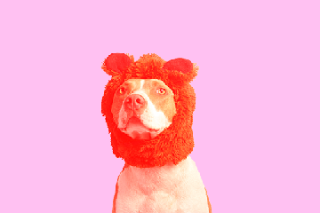

# C Image Processing Tool — Second Semester 2024

This C program allows you to apply multiple image processing filters to BMP imagess.
## Features

- Grayscale conversion (average RGB channels)
- Horizontal and vertical mirroring
- Increase and decrease contrast by a percentage
- Increase red, green, or blue tone by a percentage
- Crop image to a percentage by discarding exceeding pixels
- Resize (shrink) image to a percentage by rescaling pixels
- Rotate 90 degrees left or right
- Concatenate two images horizontally or vertically with padding

## Compilation

Compile using gcc or any C compiler:

```bash
gcc main.c -o image_processor
```

Make sure you have all source files and headers needed.

## Example Output: Red Tone Filter

When applying the red tone filter with 50% intensity on `image.bmp`, the output image is saved as:


---

You can view the output image in the `out/` directory to see the enhanced red tones.

## Usage

```bash
./image_processor <input_file(s)> <output_file> <filter> [parameter]
```

### Filters and examples:

- **Grayscale**  
  `--grayscale`  
  Converts the image to grayscale by averaging RGB values.

- **Mirror horizontally**  
  `--mirror-horizontal`

- **Mirror vertically**  
  `--mirror-vertical`

- **Increase contrast**  
  `--increase-contrast=10`  
  Increases contrast by 10% (parameter 0–100).

- **Decrease contrast**  
  `--decrease-contrast=20`  
  Decreases contrast by 20% (parameter 0–100).

- **Increase blue tone**  
  `--blue-tone=50`  
  Increases blue channel intensity by 50%.

- **Increase green tone**  
  `--green-tone=5`

- **Increase red tone**  
  `--red-tone=15`

- **Crop**  
  `--crop=30`  
  Crops the image to 30% of its original size, discarding excess pixels.

- **Shrink**  
  `--shrink=10`  
  Rescales the image to 10% of its original size (lower quality).

- **Rotate right (90° clockwise)**  
  `--rotate-right`

- **Rotate left (90° counter-clockwise)**  
  `--rotate-left`

- **Concatenate horizontally**  
  `--concat-horizontal image1.bmp image2.bmp`  
  Places two images side-by-side. Smaller height is padded.

- **Concatenate vertically**  
  `--concat-vertical image1.bmp image2.bmp`  
  Places two images one above the other. Smaller width is padded.

## Expected Output

- Processed image saved at the specified output filename.
- Console logs indicating filter application, dimensions, and output file.

## Notes

- Parameters (percentages) must be between 0 and 100.
- Input images must be 24-bit uncompressed BMP files.
- Output images are saved in the current directory or specified path.
- For concatenation filters, two input images are required.


## Author

Developed by Informatics Engineering Students — Second semester 2024.

---

## License

Open source / educational use.
